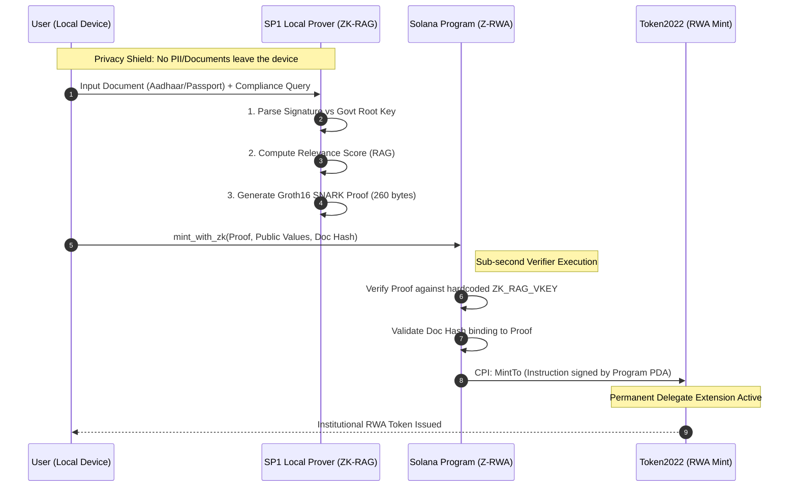

# ZK-RAG x Z-RWA Integration Documentation

## Executive Summary

### The Problem: Institutional Privacy Leak
In traditional Real World Asset (RWA) tokenization, institutional investors valid compliance checks (KYC/AML) often require exposing sensitive Personally Identifiable Information (PII) to on-chain validators or centralized intermediaries. This creates a significant "Privacy Leak," deterring high-net-worth individuals and institutions from participating in DeFi markets due to data sovereignty concerns.

### The Solution: Privacy-First Compliance
Our solution integrates **ZK-RAG (Zero-Knowledge Retrieval-Augmented Generation)** with **Z-RWA (Solana Program)**. 
- **Off-Chain**: The user proves they hold a valid document (e.g., an accredited investor certificate) matching specific relevance criteria using the SP1 Prover.
- **On-Chain**: A Zero-Knowledge Proof (Groth16) is submitted to Solana. The `z-rwa` program verifies the proof without ever seeing the document content, minting a compliance token (Token2022) upon success.

---

## Technical Handshake Architecture

The system follows a strict "Verify-then-Mint" architecture, ensuring no non-compliant assets can be issued.



### Key Components
1.  **SP1 Prover (ZK-RAG)**: Wraps the ingestion and relevance logic in a RISC-V zkVM, generating a Groth16 proof that certifies "I have a document $D$ that is relevant to query $Q$".
2.  **Solana Gatekeeper (`z-rwa`)**: An Anchor program that acts as the only authority allowed to mint the RWA token. It utilizes `sp1-solana` to cryptographically verify the proof on-chain.
3.  **Token2022 Extensions**:
    -   **Permanent Delegate**: The `z-rwa` program is set as the permanent delegate, preventing circumvented transfers.
    -   **Transfer Hooks** (Planned): To enforce ongoing compliance checks on every transfer.

---

## Security & Institutional Standards

### 1. VKey Binding (Verification Key)
The `z-rwa` smart contract enforces strict **VKey Binding**. It is hardcoded with the specific Verification Key Hash of our approved ZK-RAG circuit. 
-   **Security**: This prevents attackers from submitting valid proofs from *other* SP1 programs (e.g., a Fibonacci proof) to mint tokens.
-   **Implementation**: `sp1_solana::verify_proof` checks the proof against the `ZK_RAG_VKEY` constant in `lib.rs`: `0x00cef...`.

### 2. Multisig Governance
The Mint Authority is a Program Derived Address (PDA) of the `z-rwa` contract. Update authority for the contract itself is held by the `interop-multisig`, ensuring that no single developer can alter the compliance logic or the specific VKey without consensus.

### 3. Data Sovereignty
The actual document content *never* leaves the user's local environment (or secure enclave). Only the cryptographic proof and the document's hash are exposed on-chain.

### 4. Performance Benchmarks
Real-world proving performance for the ZK-RAG circuit (Local Release Mode):
- **Proof System**: SP1 Groth16 (v3.0.0)
- **Constraint Count**: 7,493,634
- **Proof Generation Time**: ~23.1s
- **Proving Key Size**: ~2.59 GiB (Succinct Artifacts)

```bash
✅ Proof generated successfully! 
💾 Proof saved to proof_groth16.bin
```

---

## Developer Testing Guide

We provide two modes for developers to test the integration.

### Prerequisites
-   Rust & Cargo
-   Solana CLI & Anchor
-   Node.js & Yarn/NPM

### Mode 1: Mock Proving (Dev / Vibe Coding)
For rapid iteration, use the mock prover to verify logic without generating the heavy cryptographic proof.
```bash
# In ZK-RAG/
npm run test:mock
# Outcome: Validates logic, checks constraints, returns "Mock execution successful"
```

### Mode 2: Release Proving (Devnet / Mainnet)
For final verification and on-chain submission, generate the full Groth16 proof.
```bash
# In ZK-RAG/
npm run prove:release
# Outcome: Generates proof_groth16.bin (takes ~10-20 mins)
```

### Run Integration Test
Once the proof is generated, run the full end-to-end test on Solana Devnet.
```bash
# In Z-RWA/
anchor test --provider.cluster devnet
```
This script will:
1.  Load `proof_groth16.bin` and `public_values.bin`.
2.  Setup a Token2022 Mint.
3.  Submit the proof to the `z-rwa` program.
4.  Assert that tokens were minted to your wallet.

---

**Status**: Ready for Grant Review.
