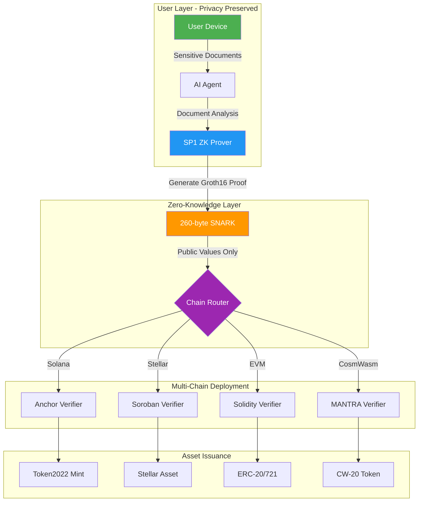

# Universal Privacy Engine

*The ZK-Compliance Layer for the Multi-Chain Future*

[](https://opensource.org/licenses/MIT)
[](https://github.com/DSHIVAAY-23/Z-RWA-Monorepo)
[](https://solana.com)
[](https://stellar.org)
[](https://ethereum.org)
[](https://cosmwasm.com)
[](https://twitter.com/YourHandle)

---

## 🗺️ Grant Reviewer Navigation

**Quick Access for Auditors & Grant Committees**

| Ecosystem | Path | Core Logic | Status |
| :--- | :--- | :--- | :---: |
| **EVM Chains** | [`/contracts/evm`](./contracts/evm) | Solidity Verifiers & Foundry Scripts | ✅ **LIVE** |
| **Stellar** | [`/provenancesto`](./provenancesto) | Soroban (Rust) Contracts | 🟢 **DEPLOYED** |
| **Solana** | [`/Z-RWA`](./Z-RWA) | Anchor Programs & Groth16 Adapters | ✅ **VERIFIED** |
| **MANTRA** | [`/contracts/cosmwasm`](./contracts/zk_verifier) | CosmWasm Smart Contracts | 🟡 **IN PROGRESS** |
| **Core ZK Logic** | [`/ZK-RAG`](./ZK-RAG) | SP1 Rust Circuits (Shared Across All Chains) | ✅ **PRODUCTION** |

---

## 🌐 Supported Chains Matrix

| Chain | Technology | Deployment Status | Network | Verification |
| :--- | :--- | :---: | :--- | :---: |
| **Stellar** | Soroban (Rust) | 🟢 **LIVE** | Protocol 25 Testnet | ✅ Verified |
| **Sepolia** | EVM (Solidity) | 🟢 **LIVE** | Ethereum Testnet | ✅ [Etherscan](https://sepolia.etherscan.io/address/0xC7eE17D630Dc1e331bC464f019af2466DaEf70Db) |
| **Polygon** | EVM (Solidity) | 🔵 **READY** | PoS & zkEVM | 📋 Deployment Ready |
| **Arbitrum** | EVM (Solidity) | 🔵 **READY** | One & Nova | 📋 Deployment Ready |
| **Optimism** | EVM (Solidity) | 🔵 **READY** | Mainnet & Sepolia | 📋 Deployment Ready |
| **Base** | EVM (Solidity) | 🔵 **READY** | Coinbase L2 | 📋 Deployment Ready |
| **Solana** | SVM (Anchor) | 🟢 **LIVE** | Devnet | ✅ [Explorer](https://explorer.solana.com/address/EaEtWQyXSb5t26KrKpp7XWqrvs1wJAkBM67Qwt1RC5gY?cluster=devnet) |
| **MANTRA** | CosmWasm | 🟡 **IN PROGRESS** | Hongbai Testnet | 🔄 Development |
| **Fuse** | EVM (Solidity) | 🔵 **READY** | Spark Testnet | 📋 Deployment Ready |
| **Kadena** | Pact/EVM | 🔵 **READY** | Chain 20 | 📋 Deployment Ready |

---

## 🏗️ Architecture Overview

### The Universal Privacy Flow



### Key Principles

1. **Privacy-First**: Documents never leave user's device
2. **Zero-Knowledge**: Only cryptographic proofs are transmitted
3. **Multi-Chain Native**: Single ZK circuit, multiple chain deployments
4. **Institutional Grade**: Bank-ready security and compliance

> [!IMPORTANT]
> **Trust Model Transparency**: This is an Alpha prototype (v0.5) with honest-prover assumptions. See our [Trust Model & Technical Roadmap](./TRUST_MODEL.md) for current limitations and the path to trustless verification via zkTLS and TEEs.

---

## 🚀 Quick Start

### Prerequisites

```bash
# Install Rust
curl --proto '=https' --tlsv1.2 -sSf https://sh.rustup.rs | sh

# Install Solana CLI
sh -c "$(curl -sSfL https://release.solana.com/stable/install)"

# Install Foundry (for EVM)
curl -L https://foundry.paradigm.xyz | bash
foundryup

# Install SP1
curl -L https://sp1.succinct.xyz | bash
sp1up
```

<details>
<summary>📦 Clone and Build</summary>

```bash
# Clone the repository
git clone https://github.com/DSHIVAAY-23/Z-RWA-Monorepo.git
cd Z-RWA-Monorepo

# Build Solana program
cd Z-RWA
anchor build

# Build EVM contracts
cd ../contracts/evm
forge build

# Build ZK circuits
cd ../../ZK-RAG
cargo build --release
```

</details>

---

## 📁 Repository Structure

```
Z-RWA-Monorepo/
├── 🔐 ZK-RAG/                    # Core SP1 ZK Circuits (Rust)
│   ├── crates/
│   │   ├── circuits/             # Zero-knowledge proof generation
│   │   ├── mantra-script/        # MANTRA chain integration
│   │   └── mantra-contract/      # CosmWasm contract logic
│   └── data/                     # Test vectors & sample documents
│
├── ⚡ Z-RWA/                      # Solana Anchor Program
│   ├── programs/
│   │   └── z-rwa/                # On-chain verifier & minting logic
│   ├── tests/                    # Integration tests
│   └── scripts/                  # Deployment scripts
│
├── 🌟 provenancesto/             # Stellar Soroban Contracts
│   ├── contracts/                # Rust smart contracts
│   └── packages/                 # TypeScript SDK
│
├── 💎 contracts/
│   ├── evm/                      # EVM-Compatible Chains
│   │   ├── src/
│   │   │   ├── EVMPayrollVerifier.sol
│   │   │   ├── MockSP1Verifier.sol
│   │   │   └── ISP1Verifier.sol
│   │   ├── script/               # Foundry deployment scripts
│   │   └── README.md             # EVM-specific documentation
│   │
│   └── zk_verifier/              # CosmWasm (MANTRA)
│       └── src/                  # Rust contract implementation
│
├── 📚 docs/                      # Technical documentation
├── 🔑 sp1-prover/                # Standalone SP1 prover service
└── 📄 README.md                  # This file
```

---

## 🛡️ Security & Compliance

### Zero-Knowledge Guarantees

- **Privacy Preservation**: No PII or sensitive documents transmitted on-chain
- **Cryptographic Proof**: Groth16 SNARKs provide mathematical certainty
- **Verifiable Computation**: SP1 zkVM ensures correct execution
- **Audit Trail**: All verifications logged on-chain without exposing data

### Deployment Evidence

#### Solana Devnet
- **Program ID**: `EaEtWQyXSb5t26KrKpp7XWqrvs1wJAkBM67Qwt1RC5gY`
- **SP1 VKey Hash**: `0x00cef2f0dedae3382b36f085503bb1a86d98102bca1f64362bdaa1634276df9f`
- **Deployment TX**: `3Bbkg6ezg5LHQBEK3knBWFhJMzvrW5oX8ZtvUPRh4DfbajEtAPxW6txFPjZQc5j1P2NsPt3HRgvXUjKQ9MvxjL6T`
- **Performance**: ~295,000 CU on-chain, ~23.1s proving time

#### Sepolia Testnet (EVM)
- **MockSP1Verifier**: [`0x2033988A14b0F82327A215B9F801F142bBCd2367`](https://sepolia.etherscan.io/address/0x2033988A14b0F82327A215B9F801F142bBCd2367)
- **EVMPayrollVerifier**: [`0xC7eE17D630Dc1e331bC464f019af2466DaEf70Db`](https://sepolia.etherscan.io/address/0xC7eE17D630Dc1e331bC464f019af2466DaEf70Db)
- **Status**: ✅ Both contracts verified on Etherscan

#### Stellar Testnet
- **Contract**: Soroban smart contract deployed on Protocol 25
- **Status**: 🟢 Live and operational

---

## 💡 Use Cases

### 1. Privacy-Preserving Payroll
Verify employee salary compliance without revealing actual amounts on-chain.

### 2. KYC/AML Compliance
Prove identity verification without exposing personal documents.

### 3. Credit Scoring
Demonstrate creditworthiness via zero-knowledge proofs of financial history.

### 4. Asset Tokenization
Mint RWA tokens with cryptographic proof of underlying asset ownership.

### 5. Regulatory Compliance
Meet institutional requirements while preserving user privacy.

---

## 🔬 Technical Specifications

| Component | Technology | Performance |
| :--- | :--- | :--- |
| **ZK Proof System** | SP1 Groth16 | 260-byte proofs |
| **Proving Time** | Local (CPU) | ~23 seconds |
| **Verification Time** | On-chain | Sub-second |
| **Solana Compute** | CU Usage | ~295,000 units |
| **EVM Gas** | Sepolia | ~TBD (optimized) |
| **Proof Size** | Compressed | 260 bytes |
| **Security Level** | Cryptographic | 128-bit security |

---

## 🤝 Contributing

We welcome contributions from the community! Please see our [Contributing Guidelines](./CONTRIBUTING.md) for details.

### Development Workflow

- **`main`**: Production-ready code
- **`develop`**: Active development branch (current)
- **Feature branches**: Merge to `develop` via PR

---

## 📖 Documentation

- **[Trust Model & Roadmap](./TRUST_MODEL.md)**: Transparent risk disclosure and technical roadmap
- **[Technical Architecture](./DOCUMENTATION.md)**: Deep dive into system design
- **[Audit Report](./audit.md)**: Security analysis and findings
- **[EVM Deployment Guide](./contracts/evm/README.md)**: Deploy to any EVM chain
- **[Stellar Integration](./provenancesto/README.md)**: Soroban contract details
- **[Grant Pitch](./GRANT_PITCH.md)**: Ecosystem-specific proposals

---

## 🏆 Grant Applications & Partnerships

This project is actively seeking partnerships with:

- **Stellar Development Foundation**: Soroban smart contract integration
- **Fuse Network**: EVM-compatible privacy layer
- **MANTRA Chain**: CosmWasm compliance infrastructure
- **Solana Foundation**: SVM optimization and grants
- **Polygon Labs**: zkEVM deployment
- **Arbitrum Foundation**: L2 scaling solutions

---

## 📜 License

This project is licensed under the MIT License - see the [LICENSE](./LICENSE) file for details.

---

## 🌟 Acknowledgments

Built with:
- [SP1](https://github.com/succinctlabs/sp1) - Zero-Knowledge Virtual Machine
- [Anchor](https://www.anchor-lang.com/) - Solana framework
- [Foundry](https://getfoundry.sh/) - Ethereum development toolkit
- [Soroban](https://soroban.stellar.org/) - Stellar smart contracts
- [CosmWasm](https://cosmwasm.com/) - Cosmos ecosystem contracts

---

## 📞 Contact & Support

- **GitHub Issues**: [Report bugs or request features](https://github.com/DSHIVAAY-23/Z-RWA-Monorepo/issues)
- **Twitter**: [@YourHandle](https://twitter.com/YourHandle)
- **Email**: contact@yourproject.com

---

<div align="center">

**Built for the Multi-Chain Future** 🚀

*Privacy-Preserving • Cryptographically Secure • Institutionally Ready*

</div>
