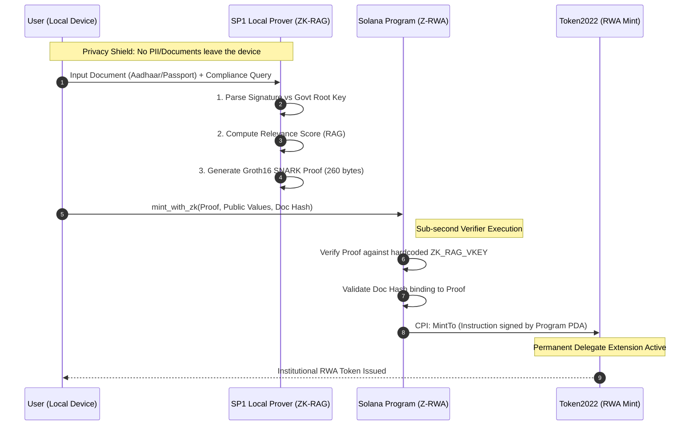

# Z-RWA Monorepo

**Status:** 🟢 Devnet Verified | **Build:** SP1-Groth16 v3.0.0 | **Target:** CoinDCX Instagrant

## Overview
This monorepo contains the complete privacy-preserving RWA minting solution, integrating ZK-Proof generation (ZK-RAG) with Solana Program verification (Z-RWA).

### Quick Links
- [Architecture Documentation](./DOCUMENTATION.md)
- [ZK-RAG Engine](./ZK-RAG/)
- [Z-RWA Solana Program](./Z-RWA/)

## Technical Architecture
The system follows a strict "Verify-then-Mint" architecture, ensuring no non-compliant assets can be issued.

## 📜 Evidence of Execution
We have successfully deployed and verified the integration on Solana Devnet.

- **SP1 VKey Hash:** `0x00cef2f0dedae3382b36f085503bb1a86d98102bca1f64362bdaa1634276df9f`
- **Solana Program ID (z_rwa):** `EaEtWQyXSb5t26KrKpp7XWqrvs1wJAkBM67Qwt1RC5gY`
- **Deployment Signature:** `3Bbkg6ezg5LHQBEK3knBWFhJMzvrW5oX8ZtvUPRh4DfbajEtAPxW6txFPjZQc5j1P2NsPt3HRgvXUjKQ9MvxjL6T`
- **Verification Performance:**
    - On-chain Verification: ~295,000 Compute Units.
    - Local Proving (Groth16): ~23.1s.

## Directory Structure
- **Z-RWA/**: Solana Smart Contract (Anchor) and Client-side tests.
  - Contains the `z-rwa` program logic for verifying proofs and minting tokens.
- **ZK-RAG/**: SP1 Prover Implementation (Rust).
  - Handles the generation of Zero-Knowledge proofs for document validity.

## Development Workflow
- **Branching**:
  - `main`: Production-ready code.
  - `develop`: Active development branch. Feature branches should merge here.
- **Submission**: All changes adhere to strict professional standards suitable for institutional review.

## Documentation
See [DOCUMENTATION.md](./DOCUMENTATION.md) for detailed architecture, security standards, and testing guides.
