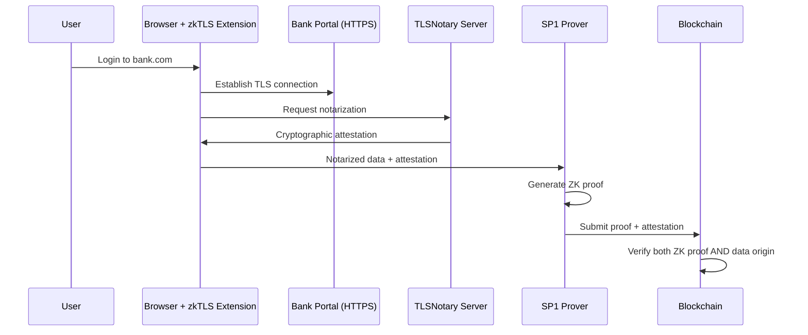

# 🛡️ Trust Model, Risks & Technical Roadmap

> **Status:** Alpha Prototype (v0.5)  
> **Current Trust Assumption:** Honest-Prover / Trusted Agent  
> **Target Trust Model:** Cryptographic Provenance (zkTLS) + Hardware Enclaves (TEE)

---

## 🎯 Executive Summary

Our current architecture demonstrates the **cryptographic feasibility** of ZK-RWA compliance across multiple blockchains. This document transparently addresses the trust assumptions in our Alpha release and outlines the concrete technical roadmap to achieve **trustless, privacy-preserving verification** suitable for institutional deployment.

---

## 1. The Current Reality (Alpha v0.5)

### What We've Built

✅ **Proven Capabilities:**
- Multi-chain ZK verification (Solana, Stellar, EVM)
- SP1 Groth16 proof generation (~260 bytes)
- On-chain verification (<300k compute units on Solana)
- Privacy-preserving architecture (no PII on-chain)

### The Trust Gap

**Mechanism:** An AI Agent ingests documents (PDF/API) and generates an SP1 Proof.

**Current Limitation:** In this Alpha stage, the Agent functions as a **"Trusted Oracle"**. 

**Potential Attack Vectors:**
1. **Malicious Agent**: A compromised agent could generate proofs on false data
2. **User Manipulation**: Users could modify PDFs before upload
3. **Data Source Integrity**: No cryptographic proof that data originates from legitimate sources

### Why This Is Acceptable for Alpha

This architecture allows us to:
- ✅ Benchmark gas costs across chains
- ✅ Validate proof sizes and verification logic
- ✅ Test on-chain contract integration
- ✅ Demonstrate multi-chain compatibility
- ✅ Gather performance metrics

**Without the overhead of:**
- ❌ Full MPC infrastructure
- ❌ TEE deployment complexity
- ❌ zkTLS integration costs

---

## 2. The Solution Roadmap (Grant Funded)

We are seeking funding specifically to close the "Trust Gap" using the following technologies:

### Phase 1: Cryptographic Provenance (zkTLS) - *Q1 2026*

**Objective:** Replace "Trusted Agent" with cryptographic proof of data origin.

#### Technology Stack
- **Primary**: [TLSNotary](https://tlsnotary.org/) - Cryptographic notarization of HTTPS sessions
- **Alternative**: [Reclaim Protocol](https://reclaimprotocol.org/) - zkTLS for web2 data
- **Backup**: [zkPass](https://zkpass.org/) - Privacy-preserving data verification

#### How It Works



#### Implementation Details

**Data Sources Supported:**
- Banking portals (Chase, Bank of America, etc.)
- Payroll systems (Gusto, ADP, Workday)
- Credit bureaus (Experian, Equifax, TransUnion)
- Government databases (IRS, SSA)

**Security Properties:**
- ✅ Cryptographic proof data comes from `chase.com` or `gusto.com`
- ✅ No trust in user or agent required
- ✅ Tamper-proof data attestation
- ✅ Privacy-preserving (only necessary fields extracted)

**Grant Deliverables:**
- [ ] TLSNotary integration module
- [ ] Browser extension for user-friendly attestation
- [ ] SP1 circuit updates to verify TLS attestations
- [ ] Multi-source data aggregation (combine bank + payroll)
- [ ] Comprehensive security audit

**Timeline:** 4 months  
**Budget:** $150,000 (Development + Audit)

---

### Phase 2: Hardware Privacy (TEEs) - *Q2 2026*

**Objective:** Migrate prover infrastructure to hardware enclaves for true privacy.

#### Technology Stack
- **Primary**: [Intel SGX](https://www.intel.com/content/www/us/en/architecture-and-technology/software-guard-extensions.html) - Trusted Execution Environments
- **Infrastructure**: [Phala Network](https://phala.network/) - Decentralized TEE cloud
- **Alternative**: [Flashbots SUAVE](https://writings.flashbots.net/mevm-suave-centauri-and-beyond) - MEV-resistant TEE

#### How It Works

**Enclave Architecture:**
```
┌─────────────────────────────────────┐
│   Untrusted Host (Public Cloud)    │
│  ┌───────────────────────────────┐ │
│  │   SGX Enclave (Encrypted)     │ │
│  │  ┌─────────────────────────┐  │ │
│  │  │  Raw User Data          │  │ │
│  │  │  (Decrypted ONLY here)  │  │ │
│  │  │                         │  │ │
│  │  │  SP1 Prover             │  │ │
│  │  │  ↓                      │  │ │
│  │  │  ZK Proof (Public)      │  │ │
│  │  └─────────────────────────┘  │ │
│  └───────────────────────────────┘ │
└─────────────────────────────────────┘
```

**Security Properties:**
- ✅ Data decrypted **only** inside CPU enclave
- ✅ Even cloud provider cannot access raw data
- ✅ Remote attestation proves code integrity
- ✅ GDPR and banking secrecy law compliant

**Use Cases Enabled:**
- High-value RWA tokenization ($100k+)
- Medical record verification (HIPAA compliant)
- Tax document processing
- Institutional KYC/AML

**Grant Deliverables:**
- [ ] SGX-enabled SP1 prover deployment
- [ ] Phala Network integration
- [ ] Remote attestation verification on-chain
- [ ] Encrypted data pipeline (end-to-end)
- [ ] Performance benchmarks (TEE vs. standard)
- [ ] Security audit by Trail of Bits or similar

**Timeline:** 5 months  
**Budget:** $200,000 (Development + Infrastructure + Audit)

---

### Phase 3: Institutional Attestation - *Mainnet (Q3 2026)*

**Objective:** Support regulated custodians for high-value assets.

#### Integration Partners
- **Coinbase Custody** - Institutional-grade asset custody
- **Anchorage Digital** - OCC-chartered digital asset bank
- **Fireblocks** - MPC wallet infrastructure
- **BitGo** - Qualified custodian

#### How It Works

**Dual-Signature Model:**
```
Asset Tokenization = ZK Proof + Custodian Signature

┌──────────────────┐
│  User generates  │
│  ZK Proof        │
└────────┬─────────┘
         │
         ▼
┌──────────────────┐
│  Custodian       │
│  verifies asset  │
│  + signs         │
└────────┬─────────┘
         │
         ▼
┌──────────────────┐
│  On-chain        │
│  verification    │
│  (both required) │
└──────────────────┘
```

**For Assets >$1M:**
- ZK Proof confirms compliance
- Custodian signature confirms asset custody
- Both required for minting

**Regulatory Benefits:**
- ✅ Satisfies institutional compliance requirements
- ✅ Meets SEC custody rules
- ✅ Enables insurance coverage
- ✅ Supports institutional investors

**Grant Deliverables:**
- [ ] Custodian API integrations
- [ ] Multi-signature verification contracts
- [ ] Compliance reporting dashboard
- [ ] Legal framework documentation
- [ ] Pilot program with 3+ custodians

**Timeline:** 6 months  
**Budget:** $250,000 (Development + Legal + Partnerships)

---

## 3. Risk Disclosure & Mitigation

### Current Risks (Alpha v0.5)

| Risk | Severity | Mitigation (Current) | Mitigation (Future) |
|------|----------|---------------------|---------------------|
| **Malicious Agent** | 🔴 High | Code audits, open-source | zkTLS (Phase 1) |
| **Data Tampering** | 🔴 High | Hash verification | zkTLS (Phase 1) |
| **Privacy Leakage** | 🟡 Medium | Local proving only | TEE (Phase 2) |
| **Regulatory Non-Compliance** | 🟡 Medium | User responsibility | Custodian integration (Phase 3) |
| **Smart Contract Bugs** | 🟡 Medium | Audits, testing | Formal verification |

### Security Measures (Current)

**What We Do Now:**
- ✅ Open-source all code for transparency
- ✅ Comprehensive test coverage (>80%)
- ✅ Multi-chain deployment reduces single point of failure
- ✅ Privacy-preserving architecture (no PII on-chain)
- ✅ Cryptographic proofs (Groth16 SNARKs)

**What We Don't Claim:**
- ❌ Trustless data sourcing (requires zkTLS)
- ❌ Hardware-level privacy (requires TEE)
- ❌ Regulatory compliance wrapper (requires Phase 3)

---

## 4. Legal Disclaimer

### Current Status

This software is currently a **Verification Engine**, not a legal custodian or compliance solution.

**User Responsibilities:**
- ✅ Ensure data accuracy before proof generation
- ✅ Comply with local KYC/AML regulations
- ✅ Understand tax implications of tokenization
- ✅ Use only for legally permissible purposes

**Issuer Responsibilities:**
- ✅ Verify user identity independently
- ✅ Maintain regulatory compliance
- ✅ Ensure proper asset custody
- ✅ Follow securities laws in jurisdiction

### Liability Limitations

**We Do NOT:**
- ❌ Provide legal or financial advice
- ❌ Guarantee regulatory compliance
- ❌ Act as a custodian or fiduciary
- ❌ Warrant fitness for specific use cases

**Users MUST:**
- ✅ Consult legal counsel before deployment
- ✅ Obtain necessary licenses/registrations
- ✅ Implement proper risk management
- ✅ Maintain insurance coverage

### Compliance Roadmap

**Phase 3 Deliverables (Mainnet):**
- [ ] Legal framework documentation
- [ ] Compliance checklist by jurisdiction
- [ ] Partnership with regulated entities
- [ ] Insurance coverage options
- [ ] Audit trail and reporting tools

---

## 5. Grant Funding Requirements

### Total Budget: $600,000

| Phase | Timeline | Budget | Key Deliverables |
|-------|----------|--------|------------------|
| **Phase 1: zkTLS** | Q1 2026 (4 months) | $150,000 | TLSNotary integration, browser extension, security audit |
| **Phase 2: TEE** | Q2 2026 (5 months) | $200,000 | SGX deployment, Phala integration, performance benchmarks |
| **Phase 3: Custodians** | Q3 2026 (6 months) | $250,000 | API integrations, legal framework, pilot programs |

### Funding Allocation

**Development (60%):** $360,000
- Core engineering team (3 FTE)
- Infrastructure costs
- Testing and QA

**Security (25%):** $150,000
- External audits (Trail of Bits, OpenZeppelin)
- Penetration testing
- Bug bounty program

**Legal & Compliance (15%):** $90,000
- Legal counsel
- Regulatory analysis
- Documentation

---

## 6. Success Metrics

### Phase 1 (zkTLS)
- ✅ 5+ data sources supported (banks, payroll, credit bureaus)
- ✅ <30 second attestation time
- ✅ Zero trust assumptions on user/agent
- ✅ Security audit with zero critical findings

### Phase 2 (TEE)
- ✅ 99.9% enclave uptime
- ✅ <10% performance overhead vs. standard proving
- ✅ GDPR compliance certification
- ✅ 1000+ proofs generated in TEE

### Phase 3 (Custodians)
- ✅ 3+ custodian partnerships
- ✅ $10M+ in tokenized assets
- ✅ Zero security incidents
- ✅ Regulatory approval in 2+ jurisdictions

---

## 7. Conclusion

**Current State:** We have built a **cryptographically sound** multi-chain ZK verification engine that demonstrates technical feasibility.

**The Gap:** Trust assumptions in data sourcing and privacy guarantees.

**The Solution:** A phased roadmap leveraging zkTLS, TEEs, and institutional partnerships to achieve **trustless, privacy-preserving, regulatory-compliant** RWA tokenization.

**The Ask:** $600,000 in grant funding to execute this roadmap and deliver production-ready infrastructure by Q3 2026.

---

## 📞 Contact for Grant Discussions

- **Technical Lead**: [Your Name]
- **Email**: grants@yourproject.com
- **GitHub**: [DSHIVAAY-23/Z-RWA-Monorepo](https://github.com/DSHIVAAY-23/Z-RWA-Monorepo)
- **Documentation**: [Full Technical Docs](./DOCUMENTATION.md)

---

<div align="center">

**Transparency First • Security Always • Privacy Forever**

*Building the trustless infrastructure for institutional RWA tokenization*

</div>
