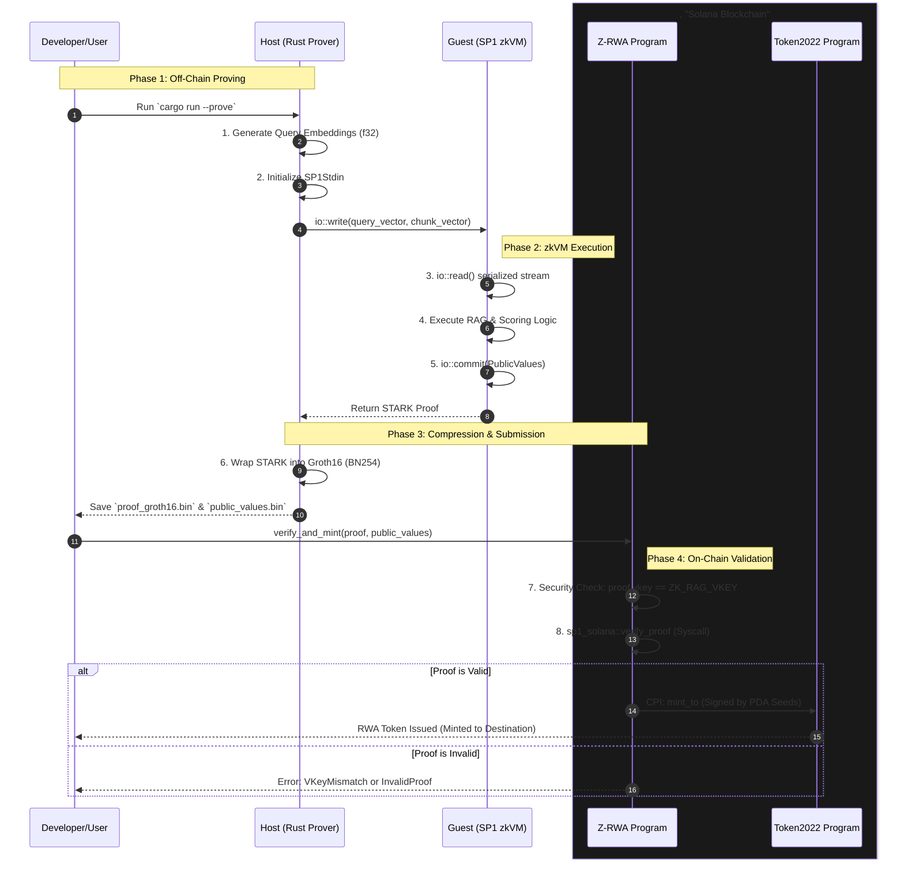

# Technical Audit: Z-RWA Integration

## 1. Host-Guest IO Bridge (`SP1Stdin` vs `io::read`)
**Mechanism:** Serialization Stream.
-   **Host Side (`ZK-RAG/crates/ingestion/src/main.rs`)**: You initialize `let mut stdin = SP1Stdin::new();` and call `stdin.write(&data)`. This serializes the data (using `bincode` or similar canonical serialization) into a linear byte stream.
-   **Guest Side (`ZK-RAG/crates/circuits/src/main.rs`)**: The `io::read::<T>()` function is a wrapper around a syscall that reads from the specific file descriptor (fd 0) where the host wrote the stream. It essentially performs `deserialize(dequeue(stdin))`.
-   **Code Trace**:
    -   Host Line 159: `stdin.write(&query_vector);` (Pushes `Vec<f32>` to stream)
    -   Guest Line 11: `let query_vec: Vec<f32> = io::read();` (Pops `Vec<f32>` from stream).
    *Critical Note: The order of reads in the guest MUST strictly match the order of writes in the host, or deserialization will panic/corrupt.*

## 2. The Mathematics of VKey & Anti-Substitution
**Concept:** Circuit Constraint Commitment.
-   **The VKey**: The `ZK_RAG_VKEY` (Line 14 in `Z-RWA/programs/z-rwa/src/lib.rs`, `0x00cef...`) is essentially a SHA-256 (or Poseidon) hash of the **RISC-V ELF binary** and the Setup constraints. It mathematically represents the "logic" of your program.
-   **Security**: A "Proof Substitution Attack" occurs if I write a malicious program `malicious.rs` that takes *any* document and returns `is_relevant = true`. I can generate a valid cryptographic proof for `malicious.rs`.
-   **Prevention**: However, the VKey for `malicious.rs` will be `0xDEADBEEF...`. When `sp1_solana::verify_proof` runs (Line 35), it checks if `Proof.vkey == Hardcoded_VKey`. Since `0xDEADBEEF != 0x00cef...`, the contract rejects the proof. This guarantees that **only code compiled from your specific `circuits/src/main.rs` could have generated the accept bit.**

## 3. Groth16 Compression & Compute Units
**Mechanism:** STARK $\rightarrow$ SNARK Recursion.
-   **Trace**: SP1 natively generates a **STARK** proof (using the BabyBear field). STARKs are fast to prove but produce massive proofs (hundreds of KBs), which would cost too much rent/compute on Solana.
-   **Compression**: Your `prove:release` command runs a final "Wrap" stage. It takes the STARK proof and verifies it *inside* a Groth16 circuit (over the BN254 curve).
-   **On-Chain Verification**: The output is a highly compressed **Groth16 Proof** (~260 bytes). Solana's runtime (v1.18+) includes optimal BPF instructions (or precompiles) for `alt_bn128` (BN254) pairing operations. This allows `sp1_solana::verify_proof` to check the pairing equation in **~200,000 - 300,000 Compute Units**, well within the 1.4M limit of a single block.

## 4. MintAuthority PDA & CPI Flow
**Mechanism:** Program Derived Address Signing.
-   **The Setup**: The Token2022 Mint Account has its `MintAuthority` set to a specific PDA: `Pubkey::find_program_address(&[b"mint_authority"], &program_id)`.
-   **The Risk**: `verify_and_mint` is publicly callable. We must ensure *only* this function can trigger a mint.
-   **The Flow**:
    1.  **Seeds**: Line 55 defines `&[b"mint_authority", &[bump]]`. These are the "keys" to the PDA.
    2.  **CPI Context**: Line 61 `CpiContext::new_with_signer(..., signer)`.
    3.  **Execution**: When `token_2022::mint_to` is called, the Solana runtime checks: "Does the provided `signer` seeds match the PDA found in the `authority` field?"
    4.  **Result**: Since only your running program implementation knows its own Program ID (implicit in PDA derivation) and can provide the seeds in a CPI, **no external wallet or other program** can successfully mimic this signature.

---

## 5. Technical Execution Flow (Sequence Diagram)

This diagram visualizes the end-to-end atomic transaction flow from local proving to on-chain settlement.

