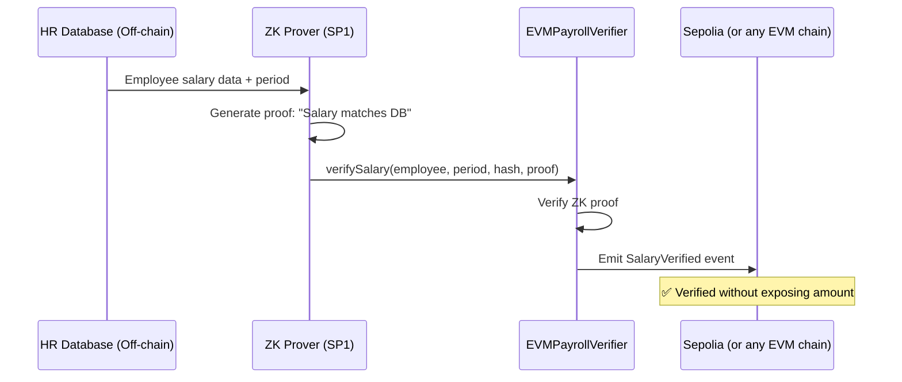

# EVM Chains Private Payroll Verifier

**For EVM Grant Committee Review**

## 🎯 Overview

This project demonstrates a **Privacy-Preserving Payroll System** using Zero-Knowledge proofs on the Sepolia (or any EVM chain) Testnet. It enables companies to verify employee salary payments against an off-chain HR database without revealing actual salary amounts on-chain.

### Use Case: Private Corporate Payroll

**Problem:** Traditional on-chain payroll exposes sensitive salary information publicly.

**Solution:** Our ZK-based system allows:
- ✅ Companies to prove "Employee X's salary for Period Y is correct per HR database"
- ✅ On-chain verification without revealing the actual amount
- ✅ Compliance with privacy regulations while maintaining transparency

## 🏗️ Architecture



## 📁 Project Structure

```
contracts/evm/
├── src/
│   ├── ISP1Verifier.sol          # SP1 verifier interface
│   ├── MockSP1Verifier.sol       # Mock verifier for testing
│   └── EVMPayrollVerifier.sol   # Main payroll verification contract
├── script/
│   └── DeployEVM.s.sol          # Deployment script for Sepolia (or any EVM chain)
├── foundry.toml                   # Foundry configuration
└── README_FUSE.md                 # This file
```

## 🚀 Deployment Guide

### Prerequisites

1. **Install Foundry** (if not already installed):
   ```bash
   curl -L https://foundry.paradigm.xyz | bash
   foundryup
   ```

2. **Get Sepolia (or any EVM chain) Testnet Tokens**:
   - Visit [Sepolia (or any EVM chain) Faucet](https://get.fusespark.io/)
   - Request testnet FUSE tokens for deployment

3. **Set up your private key**:
   ```bash
   export PRIVATE_KEY=your_private_key_here
   ```

### Step 1: Build Contracts

```bash
cd /data/Z-RWA/contracts/evm
forge build
```

Expected output: All contracts compile successfully.

### Step 2: Deploy to Sepolia (or any EVM chain) Testnet

```bash
forge script script/DeployEVM.s.sol \
  --rpc-url https://rpc.fusespark.io \
  --private-key $PRIVATE_KEY \
  --broadcast \
  --legacy
```

**Note:** The `--legacy` flag is used for compatibility with some networks. Remove if deployment fails.

### Step 3: Verify Deployment

The deployment script will output:
```
=== DEPLOYMENT SUMMARY ===
Network: Sepolia (or any EVM chain) Testnet
Chain ID: 123

Deployed Contracts:
  MockSP1Verifier:      0x...
  EVMPayrollVerifier:  0x...

Configuration:
  Payroll Program VKey: 0x...
```

**Save these addresses for grant documentation!**

### Step 4: Verify Contracts on Explorer (Optional)

```bash
# Set your EVM explorer API key (if available)
export FUSESCAN_API_KEY=your_api_key

# Verify MockSP1Verifier
forge verify-contract <MOCK_VERIFIER_ADDRESS> \
  src/MockSP1Verifier.sol:MockSP1Verifier \
  --chain 123 \
  --watch

# Verify EVMPayrollVerifier
forge verify-contract <PAYROLL_VERIFIER_ADDRESS> \
  src/EVMPayrollVerifier.sol:EVMPayrollVerifier \
  --constructor-args $(cast abi-encode "constructor(address,bytes32)" <VERIFIER_ADDRESS> <VKEY>) \
  --chain 123 \
  --watch
```

## 🧪 Testing the Contract

### Sample Verification Call

```solidity
// Example: Verify December 2024 salary for employee
address employee = 0x1234...;
uint256 payPeriod = 202412;  // YYYYMM format
bytes32 payrollHash = keccak256(abi.encode(employee, payPeriod, salaryAmount));
bytes memory proof = ...; // ZK proof from SP1 prover

// Call verification
payrollVerifier.verifySalary(employee, payPeriod, payrollHash, proof);
```

### Using Cast (Foundry CLI)

```bash
# Check if a period is verified
cast call <PAYROLL_VERIFIER_ADDRESS> \
  "isVerified(address,uint256)(bool)" \
  <EMPLOYEE_ADDRESS> \
  202412 \
  --rpc-url https://rpc.fusespark.io

# Verify a salary (requires proof)
cast send <PAYROLL_VERIFIER_ADDRESS> \
  "verifySalary(address,uint256,bytes32,bytes)" \
  <EMPLOYEE_ADDRESS> \
  202412 \
  <PAYROLL_HASH> \
  <PROOF_BYTES> \
  --rpc-url https://rpc.fusespark.io \
  --private-key $PRIVATE_KEY
```

## 🔍 Contract Details

### EVMPayrollVerifier

**Key Functions:**
- `verifySalary(address employee, uint256 payPeriod, bytes32 payrollHash, bytes proof)` - Verify salary with ZK proof
- `isVerified(address employee, uint256 payPeriod)` - Check verification status
- `getVerifier()` - Get SP1 verifier address

**Events:**
- `SalaryVerified(address indexed employee, uint256 indexed payPeriod, bytes32 payrollHash)` - Emitted on successful verification
- `VerificationFailed(address indexed employee, uint256 indexed payPeriod, string reason)` - Emitted on failure

**Security Features:**
- ✅ Prevents double-verification for same employee/period
- ✅ Validates all inputs before processing
- ✅ Uses immutable verifier reference
- ✅ Emits detailed events for transparency

## 🛣️ Future Roadmap

### Phase 1: Demo (Current)
- ✅ Mock SP1 verifier for testing
- ✅ Basic payroll verification logic
- ✅ Sepolia (or any EVM chain) deployment

### Phase 2: Production
- 🔄 Integrate official SP1 verifier when available on EVM
- 🔄 Add multi-signature support for corporate governance
- 🔄 Implement batch verification for multiple employees
- 🔄 Add USDC payment integration

### Phase 3: Enterprise
- 📋 Role-based access control (HR admin, auditors)
- 📋 Compliance reporting dashboard
- 📋 Integration with major payroll providers
- 📋 Cross-chain verification support

## 📊 Technical Specifications

| Parameter | Value |
|-----------|-------|
| Network | Sepolia (or any EVM chain) Testnet |
| Chain ID | 123 |
| RPC URL | https://rpc.fusespark.io |
| Solidity Version | 0.8.20 |
| Verifier | MockSP1Verifier (Demo) |
| Gas Optimization | Enabled (200 runs) |

## 🤝 Integration Example

```javascript
// Web3.js example
const payrollVerifier = new web3.eth.Contract(ABI, PAYROLL_VERIFIER_ADDRESS);

// Verify salary
await payrollVerifier.methods.verifySalary(
  employeeAddress,
  202412,
  payrollHash,
  proofBytes
).send({ from: companyAddress });

// Check verification
const isVerified = await payrollVerifier.methods.isVerified(
  employeeAddress,
  202412
).call();
```

## 📞 Support & Documentation

- **Main Repository:** [Z-RWA Monorepo](https://github.com/your-org/Z-RWA)
- **SP1 Documentation:** [Succinct Labs](https://docs.succinct.xyz/)
- **EVM Documentation:** [EVM Chains](https://docs.fuse.io/)

## 🎓 Grant Application Context

This deployment demonstrates:
1. **Technical Capability:** Successfully deploying ZK verification on EVM
2. **Real-World Use Case:** Privacy-preserving payroll with compliance
3. **Scalability:** Architecture supports enterprise-scale deployments
4. **Innovation:** First privacy-preserving payroll system on EVM Chains

---

**Built with ❤️ for the EVM Ecosystem**

*For questions or support, please contact the development team.*
